# 🏛️ GAU Archive Management System

<div align="center">
  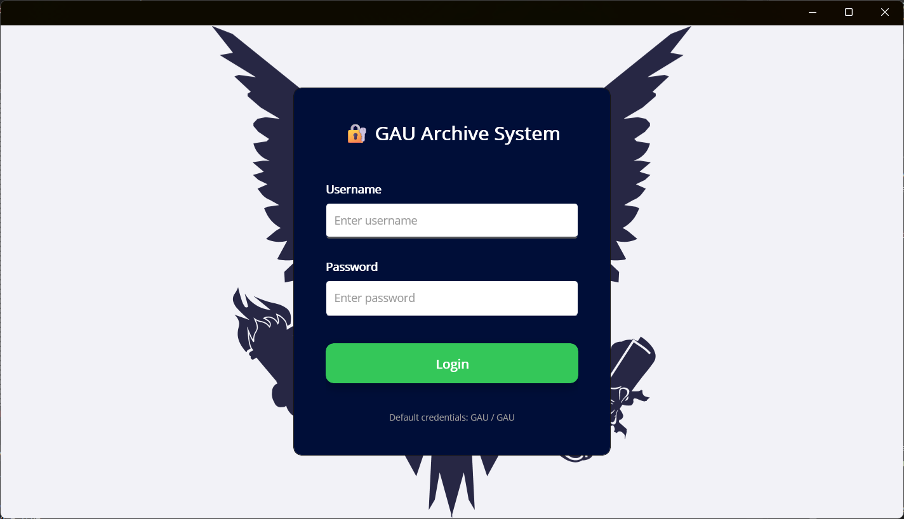
  
  <p><strong>A comprehensive .NET MAUI application for managing academic archives and document tracking</strong></p>
  
  [](https://dotnet.microsoft.com/apps/maui)
  [](https://github.com/praeclarum/sqlite-net)
  [](https://github.com/dotnet/maui)
</div>

---

## 📋 Table of Contents

- [Overview](#overview)
- [Features](#features)
- [Screenshots](#screenshots)
- [Technology Stack](#technology-stack)
- [Project Structure](#project-structure)
- [Installation](#installation)
- [Usage](#usage)
- [Database Schema](#database-schema)
- [Contributing](#contributing)
- [License](#license)

---
<a id="overview"></a>
## 🎯 Overview

The **GAU Archive Management System** is a cross-platform desktop and mobile application designed for Girne American University (GAU) to efficiently manage academic document archives. The system provides a complete solution for storing, tracking, borrowing, and retrieving educational documents such as midterms, finals, projects, and other academic materials.

### Key Objectives

- **Centralized Archive Management**: Store and organize all academic documents in a structured database
- **Location Tracking**: Utilize a shelf-based location system for physical document placement
- **Borrow & Return System**: Track document lending with borrower information and timestamps
- **Multi-User Support**: User authentication and role management
- **Cross-Platform**: Works seamlessly on Android, iOS, and Windows platforms

---
<a id="features"></a>
## ✨ Features

### 🔐 Authentication & User Management
- Secure login system with username/password authentication
- Default credentials: `GAU / GAU`
- User profile management (change username/password)


### 📁 Document Archive Management

#### Add Documents to Archive
- Support for multiple document types (Midterms, Finals, Quiz1, Quiz2, Graduation Projects, etc.)
- Comprehensive metadata fields:
  - File Type
  - Course ID
  - Teacher Name
  - Year & Semester
  - Physical Location
  - Archive Date

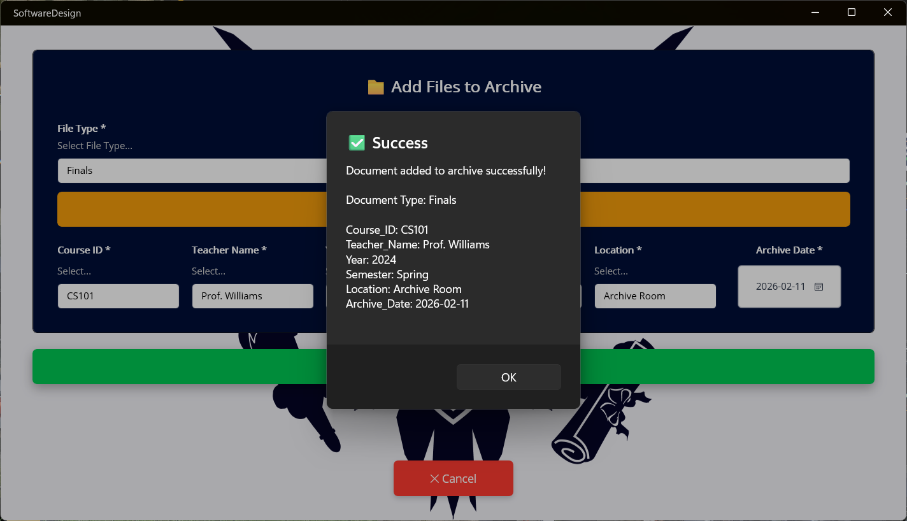
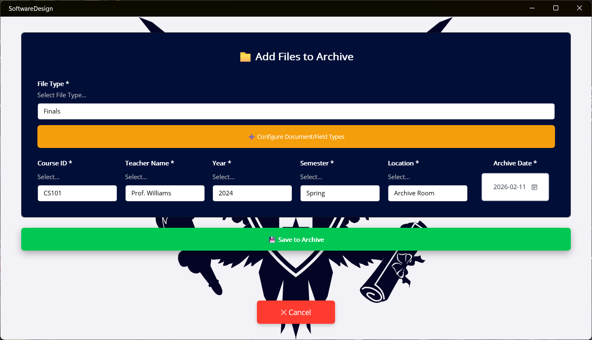

#### Database Browser
- Search and filter documents by multiple criteria
- View all archived records
- Quick statistics: Total databases, Selected items, Borrowed files
- Bulk operations (Select All, Delete)

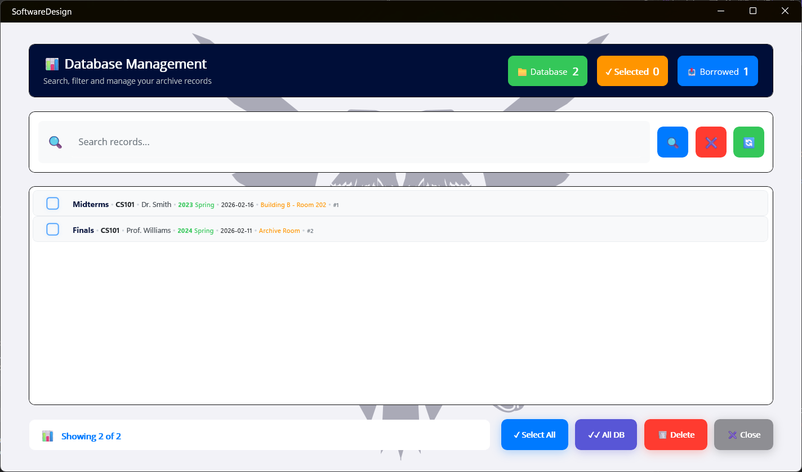

### 🔍 Smart Search System
- Advanced search functionality with multiple filters:
  - File Type
  - Course ID
  - Teacher Name
  - Year
  - Semester
  - Location
  - Archive Date

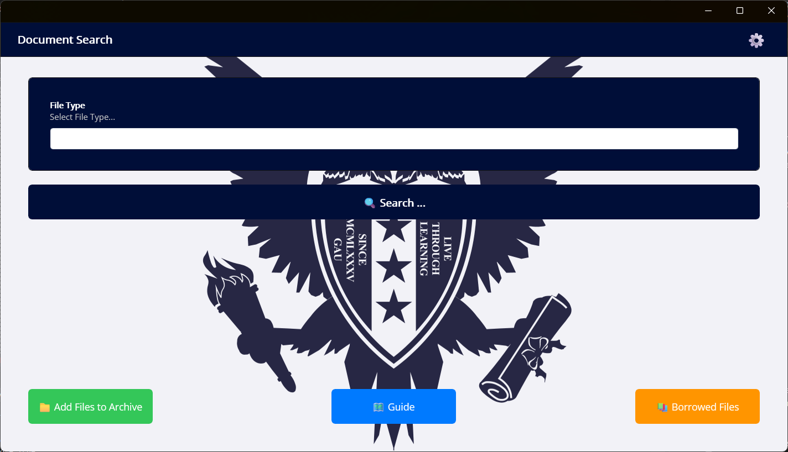

- Detailed search results with complete document information
- One-click borrowing from search results

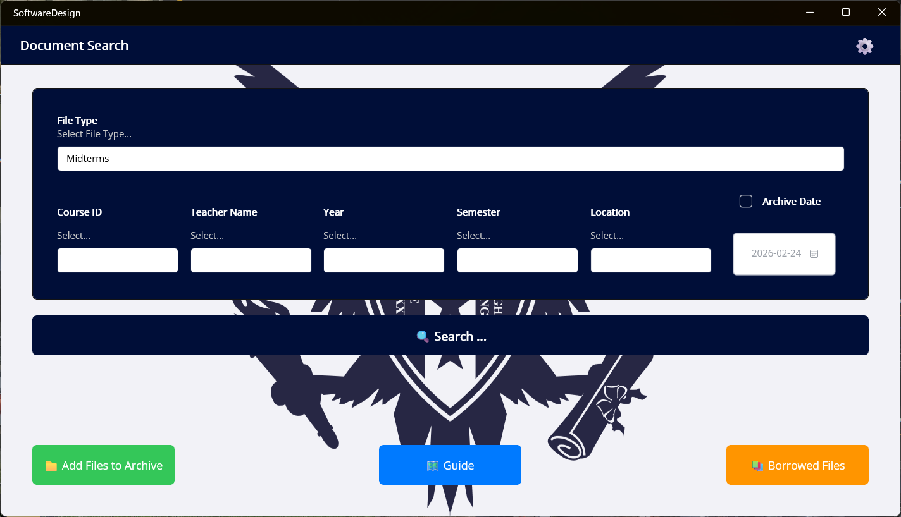

### 📚 Document Borrowing System

#### Borrow Documents
- Record borrower information
- Automatic timestamp tracking
- Status management (Available → Active)

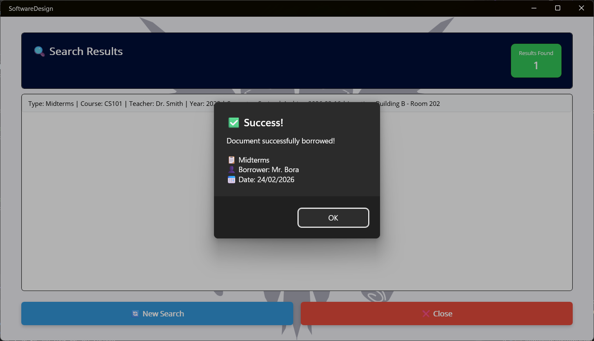
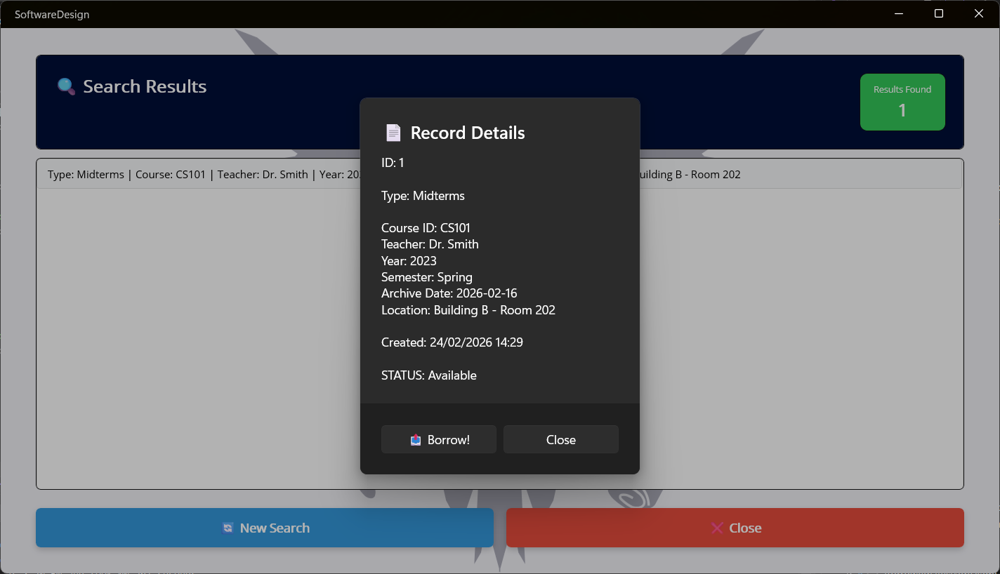

#### Borrowed Files Dashboard
- View all currently borrowed documents
- Track borrowing duration
- Quick return functionality
- Real-time statistics (Total Borrowed, Currently Active)

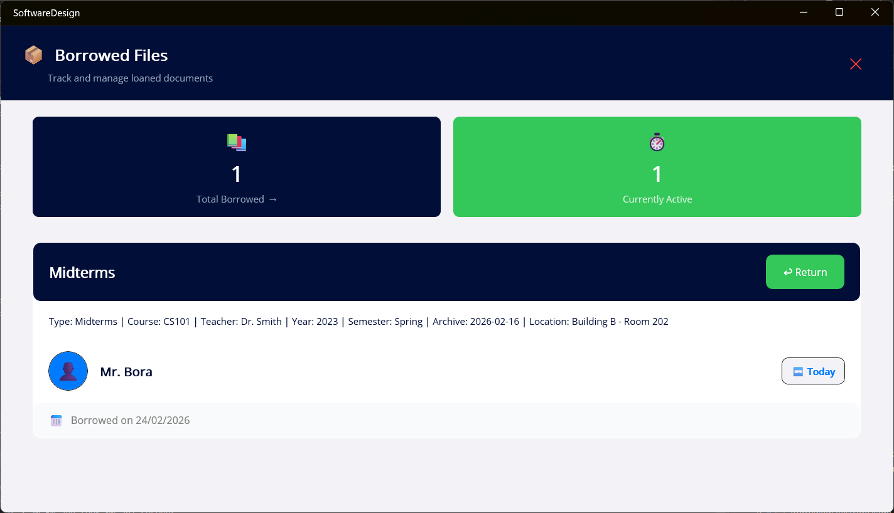

#### Borrowing History
- Complete borrowing history with status tracking
- Filter by status (All Records, Active, Returned)
- Document details: Borrower, Course, Borrowed Date, Duration

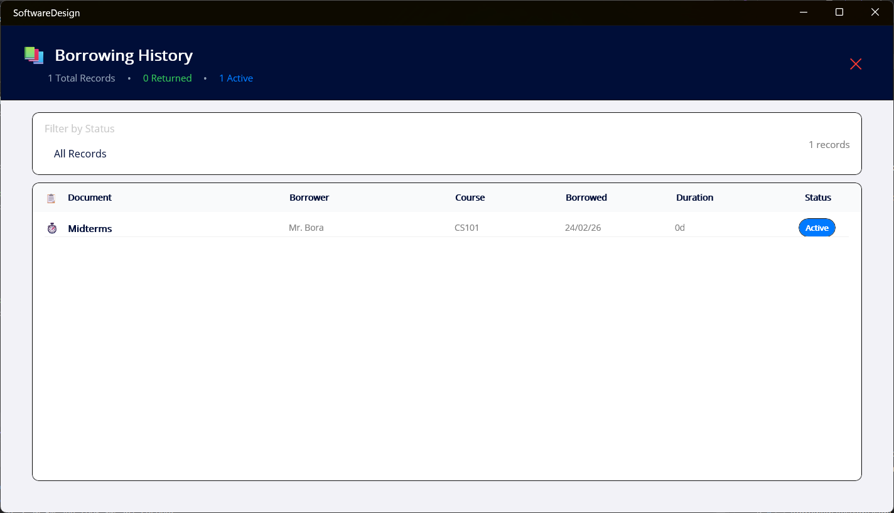
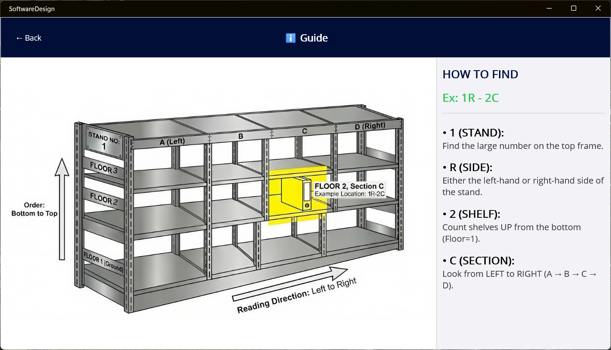

### 🗺️ Location Management

#### Archive Guide
- Visual shelf location system
- Standardized coding: `[Stand][Side]-[Shelf][Section]`
  - **Stand**: Large number on top frame (e.g., 1)
  - **Side**: L (Left) or R (Right)
  - **Shelf**: Count from bottom (Floor = 1)
  - **Section**: A, B, C, D from left to right
- Example: `1R-2C` = Stand 1, Right side, Floor 2, Section C

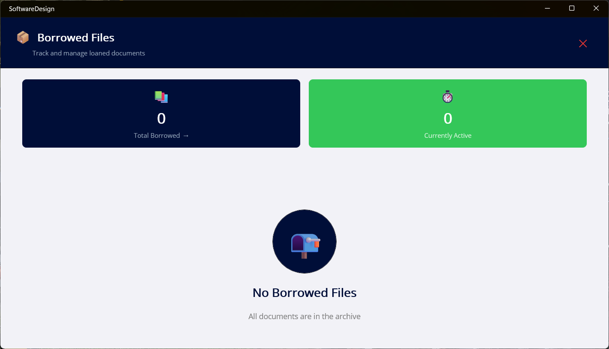

#### Populate Locations Tool
- Automatic shelf code generation
- Batch creation of location codes
- Configurable parameters:
  - Row Count (e.g., 15)
  - Sides (L, R - comma separated)
  - Shelf Height (e.g., 5)
  - Sections (A, B, C, D - comma separated)

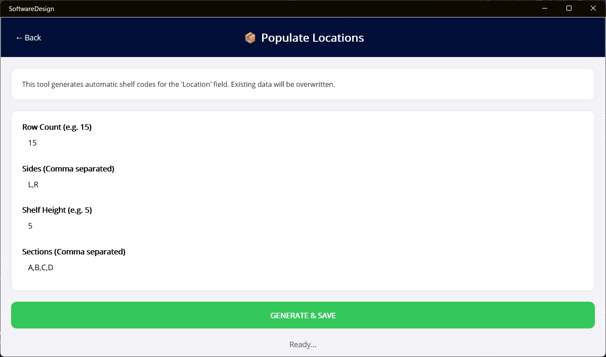

### ⚙️ Settings & Configuration

#### System Settings
- Database path configuration
- User account management:
  - Change Username
  - Change Password
- Database management tools
- Location population
- Guide access
- Reset to default settings
- Logout functionality

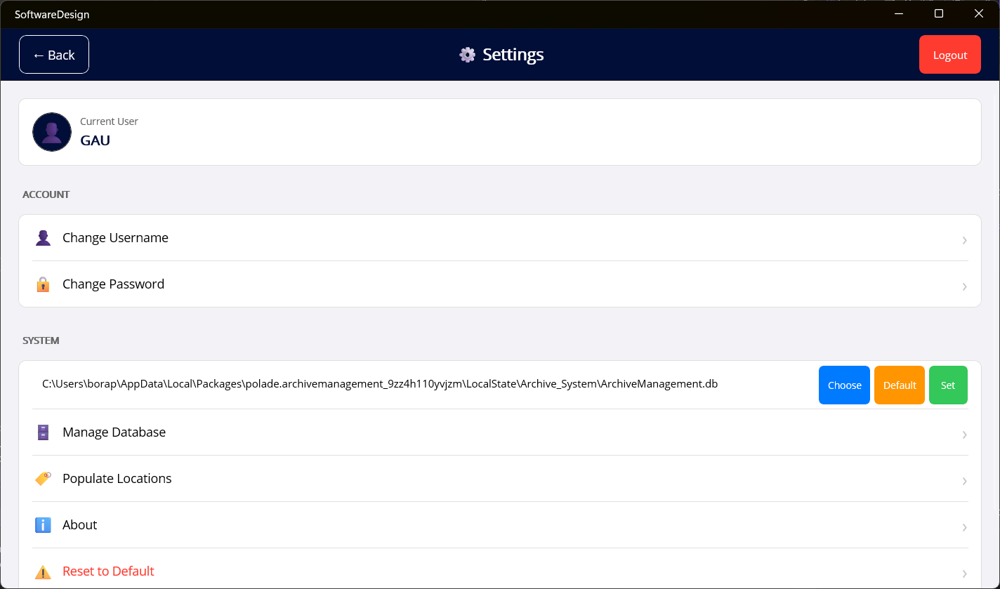

#### Document Type Management
- Configure custom document types
- Add new document types with descriptions
- Manage required fields for each type
- Field customization

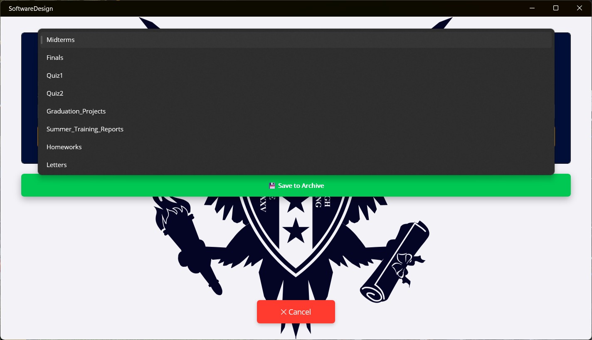
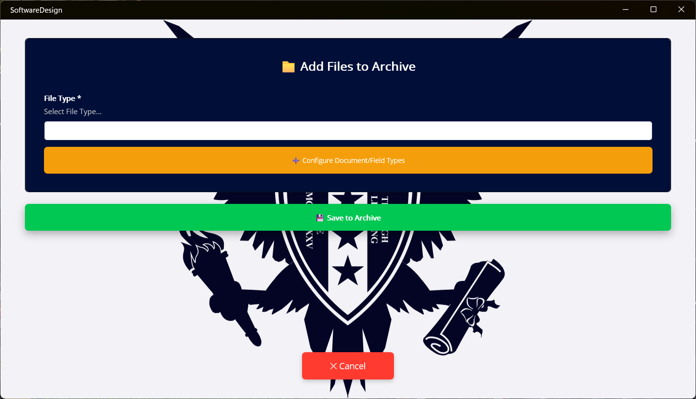

---
<a id="technology-stack"></a>
## 🛠️ Technology Stack

### Frontend
- **.NET MAUI 9.0**: Cross-platform UI framework
- **XAML**: Declarative UI markup
- **C#**: Primary programming language

### Backend & Database
- **SQLite**: Local database engine
- **sqlite-net-pcl 1.9.172**: SQLite ORM for .NET
- **SQLitePCLRaw.bundle_green 2.1.11**: SQLite PCL raw bindings

### Development Tools
- **Visual Studio 2022**: Primary IDE
- **.NET 9.0 SDK**: Latest .NET framework
- **Target Platforms**:
  - Android
  - iOS
  - Windows 10.0.19041.0+

---
<a id="project-structure"></a>
## 📂 Project Structure

```
SoftwareDesign/
├── 📄 App.xaml                          # Application definition
├── 📄 App.xaml.cs                       # Application logic
├── 📄 AppShell.xaml                     # Shell navigation
├── 📄 AppShell.xaml.cs                  # Shell logic
│
├── 🔐 Authentication
│   ├── LoginPage.xaml                   # Login interface
│   └── LoginPage.xaml.cs                # Login logic
│
├── 📁 Archive Management
│   ├── AddToArchivePopup.xaml           # Add document form
│   ├── AddToArchivePopup.xaml.cs        # Add document logic
│   ├── ManageDatabasePage.xaml          # Database browser
│   ├── ManageDatabasePage.xaml.cs       # Database operations
│   └── MainPage.xaml                    # Main search interface
│
├── 📚 Borrowing System
│   ├── BorrowedFilesPage.xaml           # Borrowed files dashboard
│   ├── BorrowedFilesPage.xaml.cs        # Borrowing management
│   ├── BorrowingHistoryPage.xaml        # History view
│   └── BorrowingHistoryPage.xaml.cs     # History logic
│
├── 🔧 Configuration
│   ├── SettingsPage.xaml                # Settings interface
│   ├── SettingsPage.xaml.cs             # Settings logic
│   ├── ManageDocumentTypesPage.xaml     # Document type config
│   ├── ManageDocumentTypesPage.xaml.cs  # Type management
│   ├── ManageFieldsPage.xaml            # Field configuration
│   └── ManageFieldsPage.xaml.cs         # Field management
│
├── 🗺️ Location System
│   ├── PopulateLocationsPage.xaml       # Location generator
│   ├── PopulateLocationsPage.xaml.cs    # Location logic
│   ├── guide.xaml                       # Location guide
│   └── guide.xaml.cs                    # Guide logic
│
├── 🔍 Search & Utilities
│   ├── SearchResultsPopup.xaml          # Search results popup
│   ├── SearchResultsPopup.xaml.cs       # Results logic
│   ├── AddDocumentTypePopup.xaml        # Add type popup
│   ├── AddDocumentTypePopup.xaml.cs     # Add type logic
│   ├── EditPickerOptionsPopup.xaml      # Edit picker options
│   ├── EditPickerOptionsPopup.xaml.cs   # Picker logic
│   ├── MultiSelectFieldsPopup.xaml      # Multi-select fields
│   └── MultiSelectFieldsPopup.xaml.cs   # Multi-select logic
│
├── 🛠️ Utilities
│   ├── Converters.cs                    # Value converters
│   └── MauiProgram.cs                   # App startup
│
├── 📦 Resources
│   ├── AppIcon/                         # Application icons
│   ├── Splash/                          # Splash screens
│   ├── Images/                          # Image resources
│   │   └── gau_logo.png                 # GAU logo
│   ├── Fonts/                           # Font resources
│   └── Raw/                             # Raw assets
│
└── 📄 SoftwareDesign.csproj             # Project configuration
```

---
<a id="installation"></a>
## 🚀 Installation

### Prerequisites

1. **Visual Studio 2022** (version 17.12 or later)
   - Workload: `.NET Multi-platform App UI development`
   
2. **.NET 9.0 SDK**
   ```bash
   dotnet --version  # Should show 9.0.x or later
   ```

3. **Platform-specific requirements**:
   - **Windows**: Windows 10 version 1809 or later
   - **Android**: Android SDK 21 or later
   - **iOS**: macOS with Xcode 15 or later

### Steps

1. **Clone the repository**
   ```bash
   git clone https://github.com/yourusername/gau-archive-management.git
   cd gau-archive-management
   ```

2. **Restore NuGet packages**
   ```bash
   dotnet restore
   ```

3. **Build the project**
   ```bash
   dotnet build
   ```

4. **Run the application**
   
   **For Windows:**
   ```bash
   dotnet run --framework net9.0-windows10.0.19041.0
   ```
   
   **For Android:**
   ```bash
   dotnet run --framework net9.0-android
   ```
   
   **For iOS:**
   ```bash
   dotnet run --framework net9.0-ios
   ```

### First Run Setup

1. Launch the application
2. Login with default credentials:
   - **Username**: `GAU`
   - **Password**: `GAU`
3. Navigate to Settings to configure:
   - Database location
   - User credentials (recommended)
   - Document types
4. Use "Populate Locations" to generate shelf codes
5. Start adding documents to the archive!

---
<a id="usage"></a>
## 💡 Usage

### Adding a New Document

1. From the main page, click **"Add Files to Archive"**
2. Select the **File Type** from the dropdown
3. Fill in required information:
   - Course ID (e.g., CS101)
   - Teacher Name (e.g., Prof. Williams)
   - Year (e.g., 2024)
   - Semester (Spring/Fall/Summer)
   - Location (e.g., 1R-2C)
   - Archive Date
4. Click **"Save to Archive"**
5. Confirmation message appears

### Searching for Documents

1. On the main page, enter search criteria:
   - File Type (optional)
   - Course ID
   - Teacher Name
   - Year
   - Semester
   - Location
   - Archive Date
2. Click **"Search..."**
3. View results with complete document details
4. Click on a result to see more details or borrow

### Borrowing a Document

1. Search for and locate the document
2. Click on the document to open details
3. Click **"Borrow!"** button
4. Enter borrower information (if prompted)
5. Confirmation message appears
6. Document status changes from "Available" to "Active"

### Returning a Document

1. Navigate to **"Borrowed Files"**
2. Find the document in the active list
3. Click the **"Return"** button
4. Document returns to "Available" status
5. Record moves to borrowing history

### Generating Location Codes

1. Go to **Settings** → **"Populate Locations"**
2. Configure parameters:
   - **Row Count**: Number of stands (e.g., 15)
   - **Sides**: L,R (both sides)
   - **Shelf Height**: Number of shelves (e.g., 5)
   - **Sections**: A,B,C,D (sections per shelf)
3. Click **"GENERATE & SAVE"**
4. System generates all location codes (e.g., 1R-2C, 1L-3A, etc.)

---
<a id="database-schema"></a>
## 🗄️ Database Schema

The application uses SQLite with the following main tables:

### Documents Table
```sql
CREATE TABLE Documents (
    Id INTEGER PRIMARY KEY AUTOINCREMENT,
    Type TEXT NOT NULL,
    CourseId TEXT NOT NULL,
    TeacherName TEXT NOT NULL,
    Year INTEGER NOT NULL,
    Semester TEXT NOT NULL,
    Location TEXT NOT NULL,
    ArchiveDate TEXT NOT NULL,
    Status TEXT DEFAULT 'Available',
    CreatedAt DATETIME DEFAULT CURRENT_TIMESTAMP
);
```

### BorrowingRecords Table
```sql
CREATE TABLE BorrowingRecords (
    Id INTEGER PRIMARY KEY AUTOINCREMENT,
    DocumentId INTEGER NOT NULL,
    BorrowerName TEXT NOT NULL,
    BorrowDate TEXT NOT NULL,
    ReturnDate TEXT,
    Duration TEXT,
    Status TEXT DEFAULT 'Active',
    FOREIGN KEY (DocumentId) REFERENCES Documents(Id)
);
```

### DocumentTypes Table
```sql
CREATE TABLE DocumentTypes (
    Id INTEGER PRIMARY KEY AUTOINCREMENT,
    TypeName TEXT UNIQUE NOT NULL,
    Description TEXT,
    RequiredFields TEXT
);
```

### Locations Table
```sql
CREATE TABLE Locations (
    Id INTEGER PRIMARY KEY AUTOINCREMENT,
    LocationCode TEXT UNIQUE NOT NULL,
    Stand INTEGER,
    Side TEXT,
    Shelf INTEGER,
    Section TEXT
);
```

### Users Table
```sql
CREATE TABLE Users (
    Id INTEGER PRIMARY KEY AUTOINCREMENT,
    Username TEXT UNIQUE NOT NULL,
    Password TEXT NOT NULL,
    Role TEXT DEFAULT 'User',
    CreatedAt DATETIME DEFAULT CURRENT_TIMESTAMP
);
```

---
<a id="contributing"></a>
## 🤝 Contributing

Contributions are welcome! Please follow these steps:

1. **Fork the repository**
2. **Create a feature branch**
   ```bash
   git checkout -b feature/amazing-feature
   ```
3. **Commit your changes**
   ```bash
   git commit -m "Add some amazing feature"
   ```
4. **Push to the branch**
   ```bash
   git push origin feature/amazing-feature
   ```
5. **Open a Pull Request**

### Coding Standards

- Follow C# naming conventions
- Use XAML for UI design
- Write meaningful commit messages
- Add comments for complex logic
- Test on all target platforms before submitting

---
<a id="license"></a>
## 📝 License
This project is licensed under the **MIT License** - see the [LICENSE](LICENSE) file for details.

Copyright (c) 2026 Bora Polat
Email: borapolade@outlook.com

You are free to use, modify, develop, and distribute this software, provided
that the original author name and license notice are included.

---

## 👥 Authors

- **Bora POLAT, Ibrahim DEGER, Emir Mert TANRIVERDI** - [BoraPolat](https://github.com/BoraPolat)

---

## 🙏 Acknowledgments

- **Girne American University (GAU)** for the project inspiration
- **.NET MAUI Team** for the excellent cross-platform framework
- **SQLite** for the robust embedded database
- All contributors and testers

---

## 📧 Contact

For questions, suggestions, or support:

- **Email**: borapolade@outlook.com
- **University**: Girne American University

---

<div align="center">
  <p>© 2026 GAU Archive Management System</p>
</div>
